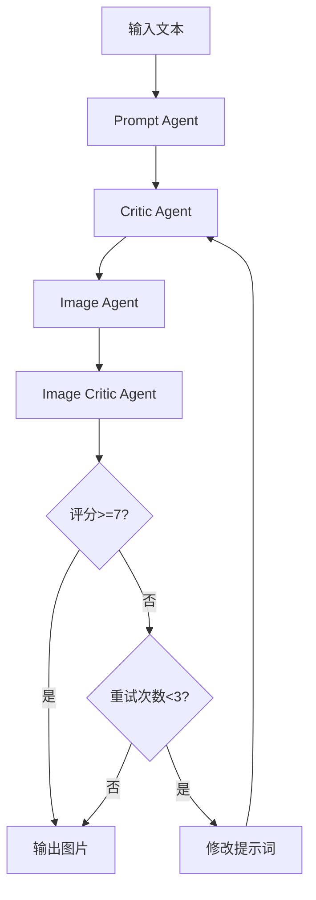

# Funding-figure-drawing-agent
适用于国自然/省青基/面上等项目的草图绘制Agent
# 科研绘图Agent

基于LangGraph框架的科研绘图Agent系统，能够自动将科研文本转换为BioRender风格的机制图。

## 🏗️ 架构设计

```
输入文本 → Prompt Agent → Critic Agent → Image Agent → Image Critic Agent → 输出图片
                                    ↑                                      ↓
                                    └────────── 重试机制（最多3次）←─────────┘
```

### Sub-Agents

1. **Prompt Generator Agent** (`gemini-3-flash-preview-thinking`)
   - 分析科研文本
   - 生成BioRender风格的绘图提示词

2. **Critic Agent** (`gemini-3-flash-preview-thinking`) ⭐
   - 审核生成的提示词
   - 检查内容完整性（核对原始输入，确保无遗漏和冲突）
   - 检查格式规范（16:9比例、背景全白、BioRender风格等）
   - 检查风格一致性
   - 自动修正和优化提示词
   - 提供详细的审核反馈

3. **Image Generator Agent** (`gemini-3-pro-image-preview`)
   - 根据优化后的提示词生成科研绘图
   - 保存图片到本地

4. **Image Critic Agent** (`gemini-3-flash-preview-thinking`) ⭐ **新增**
   - 评价生成图片的质量
   - 检查文字清晰度
   - 检查格式规范（浅灰蓝色细线描边、浅蓝灰色标题栏、纯白填充等）
   - 检查布局合理性（留白是否过多）
   - 检查内容一致性（是否与原始输入对应）
   - 检查逻辑清晰度（指向是否清晰无冲突）
   - 评分低于7分时触发重试机制

## 📦 安装

```bash
pip install -r requirements.txt
```

## ⚙️ 配置

1. 复制环境变量模板:
```bash
cp .env.example .env
```

2. 编辑 `.env` 文件，填入你的API密钥:
```
OPENAI_API_KEY=your_api_key_here
BASE_URL=https://api.bianxie.ai/v1
```

## 🚀 使用方法

### 基本使用

```python
from main import run_scientific_drawing_agent

article_text = """
你的科研文本内容...
"""

result = run_scientific_drawing_agent(article_text)
print(f"图片路径: {result['image_path']}")
print(f"图片质量评分: {result['image_quality_score']}/10")
print(f"重试次数: {result['retry_count']}")

# 查看Critic反馈
if result.get('critic_feedback'):
    print("Prompt审核反馈:", result['critic_feedback'])

if result.get('image_critic_feedback'):
    print("图片质量反馈:", result['image_critic_feedback'])
```

### 命令行运行

```bash
python main.py
```

## 🔧 LangSmith集成

要启用LangSmith监控，在 `.env` 文件中添加:

```
LANGCHAIN_TRACING_V2=true
LANGCHAIN_API_KEY=your_langsmith_api_key
LANGCHAIN_PROJECT=scientific-drawing-agent
```

## 📁 项目结构

```
scientific-drawing-agent/
├── config.py              # 配置文件
├── state.py               # 状态定义
├── prompt_agent.py        # Prompt生成Agent
├── reflection_agent.py    # Critic审核Agent ⭐
├── image_agent.py         # 图片生成Agent
├── image_critic_agent.py  # 图片质量评价Agent ⭐
├── workflow.py            # LangGraph工作流
├── main.py                # 主程序入口
├── requirements.txt       # 依赖包
├── .env.example           # 环境变量模板
└── output/                # 输出图片目录
```

## 🎯 工作流程



## 📝 Critic Agent功能详解

### Prompt Critic审核内容

1. **内容完整性检查**
   - 核对原始输入内容
   - 确保没有遗漏重要信息
   - 检查是否存在冲突

2. **格式规范检查**
   - ✅ 比例为16:9
   - ✅ 内容部分背景全白
   - ✅ BioRender风格
   - ✅ 卡片式边框、浅蓝灰色标题栏
   - ✅ 纯白填充、无渐变、无阴影
   - ✅ 文字必须全部为中文

3. **风格一致性检查**
   - BioRender扁平化科研风格
   - 配色方案合理性
   - 文字规范（仅限中文关键词）

### Image Critic评价内容

1. **文字清晰度**
   - 图中所有文字是否清晰可读
   - 字体大小是否合适
   - 是否存在文字重叠或模糊

2. **格式规范检查**
   - 是否符合浅灰蓝色细线描边的大圆角矩形模块框
   - 是否有浅蓝灰色标题栏，且标题栏与外框一体化连接
   - 除标题栏外，所有模块内容区域是否严格纯白填充
   - 是否存在浅灰底、浅蓝底、彩色底或渐变底

3. **布局合理性**
   - 图片是否存在留白区域过多
   - 各模块之间的间距是否合理
   - 整体布局是否平衡

4. **内容一致性**
   - 图片内容能否和原始输入需要做图的内容对得上
   - 是否遗漏了重要的概念或流程
   - 是否存在与原始内容不符的地方

5. **逻辑清晰度**
   - 若存在指向箭头，是否清晰明确
   - 是否存在指向冲突或逻辑混乱
   - 流程走向是否合理

## 🔄 重试机制

系统实现了智能重试机制：

- **触发条件**：Image Critic评分低于7分
- **最大重试次数**：3次
- **重试流程**：
  1. Image Critic发现问题并给出改进建议
  2. 系统自动修改提示词
  3. 重新生成图片
  4. 再次评价质量
  5. 循环直到质量合格或达到最大重试次数

## 📊 示例输出

### 输入
```
科研文本：多源异构知识的冲突消解与推理检索...
```

### Prompt Critic反馈示例
```
### 发现的问题
1. 语言规范违规：出现了大量英文标签
2. 风格描述冲突：同时提到了"flat design"和"3D icons"
3. 格式细节缺失：未明确强调"比例为16:9"
4. 背景描述不够严谨：需要更强力地强调"内容区域严禁任何渐变或阴影"

### 改进建议
1. 全面汉化：将所有模型名称和技术术语替换为中文关键词
2. 统一风格：删除所有关于"3D"的描述
3. 强化背景要求：重复强调"纯白填充（#FFFFFF）"和"无阴影"
4. 明确比例：在提示词开头明确标注"比例为16:9"
```

### Image Critic反馈示例
```
### 评分（满分10分）
8.5分

### 发现的问题
1. 布局逻辑与原始需求略有偏差：采用了"左二-中一-右二"的非对称布局
2. 逻辑连线缺失：模块3直接指向了模块5，缺乏从模块3到模块4的逻辑引导线
3. 文字细节瑕疵：模块3"检索结果"框内的文字存在AI幻觉

### 改进建议
1. 强化布局控制：在提示词中加入横向序列布局描述
2. 修正逻辑指向：增加从模块3到模块4的连接
3. 优化文字渲染：简化列表内容描述

### 是否需要重新生成
否（除非对逻辑严谨性有极高要求）
```

### 输出
```
✅ 图片已保存: output/scientific_drawing_20260320_170557.jpeg
📊 图片质量评分: 8.5/10
🔄 重试次数: 0
```

## 🔍 监控与调试

启用LangSmith后，可以在LangSmith控制台查看:
- 每个Agent的执行情况
- Critic Agent的审核过程
- Image Critic Agent的评价过程
- 重试次数和原因
- Token使用量
- 执行时间
- 错误追踪
- 完整的调用链

## 🎯 核心特性

1. ✅ **双重审核机制**：Prompt Critic + Image Critic
2. ✅ **智能重试**：最多3次自动重试，持续优化质量
3. ✅ **模块化设计**：每个Sub-Agent独立封装
4. ✅ **LangGraph框架**：基于状态图的流程控制
5. ✅ **错误处理**：完善的错误处理机制
6. ✅ **LangSmith兼容**：支持监控和调试
7. ✅ **自动保存**：图片自动保存到本地
8. ✅ **详细反馈**：提供完整的审核和评价报告

## 📈 后续优化建议

1. **添加更多审核维度**: 如学术规范、图表可读性等
2. **支持批量处理**: 一次处理多个科研文本
3. **添加用户反馈**: 允许用户对审核结果进行确认
4. **支持更多图片格式**: PNG、SVG等
5. **添加图片编辑功能**: 允许用户对生成的图片进行简单编辑
6. **优化重试策略**: 根据具体问题类型选择不同的重试策略

## 📄 License

MIT License
